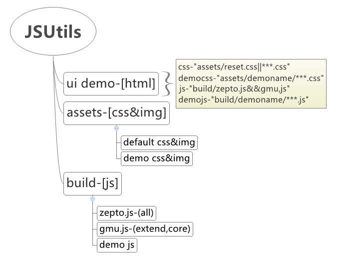

JSUtils
=======

代码库暂时放在这里，我回头整理好，会上传SVN，大家先从git上下载。我有更新，会邮件通知大家。
文件清单
-------
slider文件夹和assets文件夹是demo演示效果要用到的文件
build文件夹中的文件中得js文件，是打包后的文件，也是大家在项目中要引用的文件。
[zepto.js](http://zeptojs.com/)包括了zepto现在所有的模块。
[gmu.js](http://gmu.baidu.com/)包括了gmu中得extend,core文件夹下得所有的文件。
slider文件夹下得slider.js是gmu项目中得slider所有文件打包后的文件。关于slider的使用，请参考文件中的demo（html文件在slider里）

###imglazyload plugin
			
			
			<!--@event.scrollstop.js注意，此文件依赖gmu throttle方法，必须在gmu之后引用-->
			
			
###popover plugin
		    $('#btn1').popover({
			//@arrow是否有箭头，默认显示
	    	arrow:false,
    	    content: 'Hello world!'
    		});